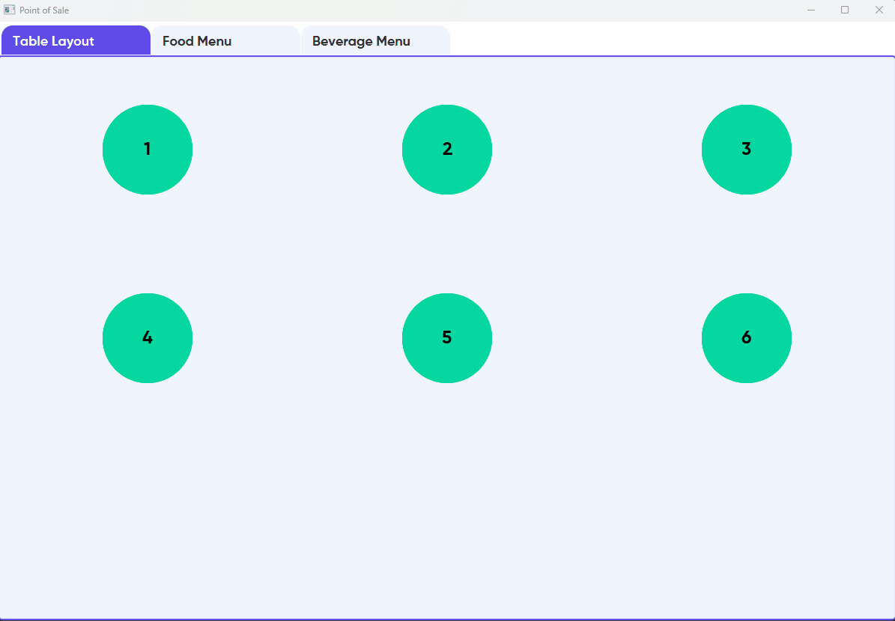
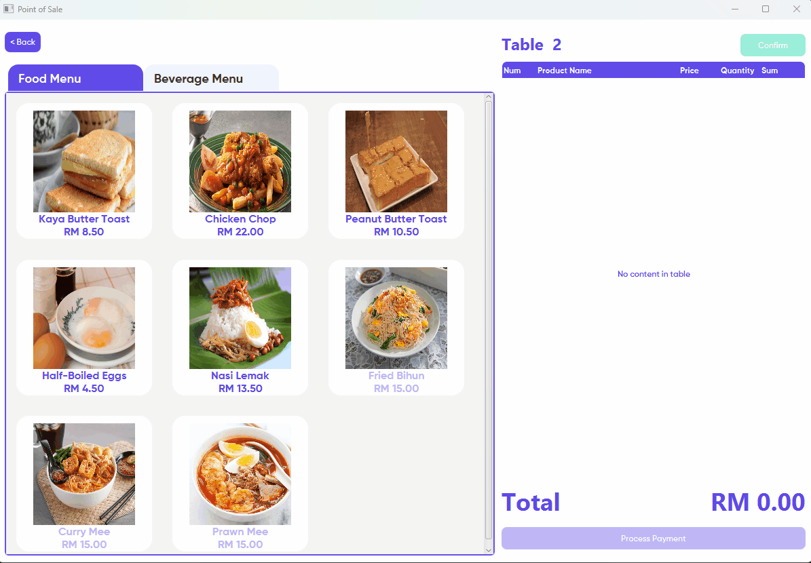
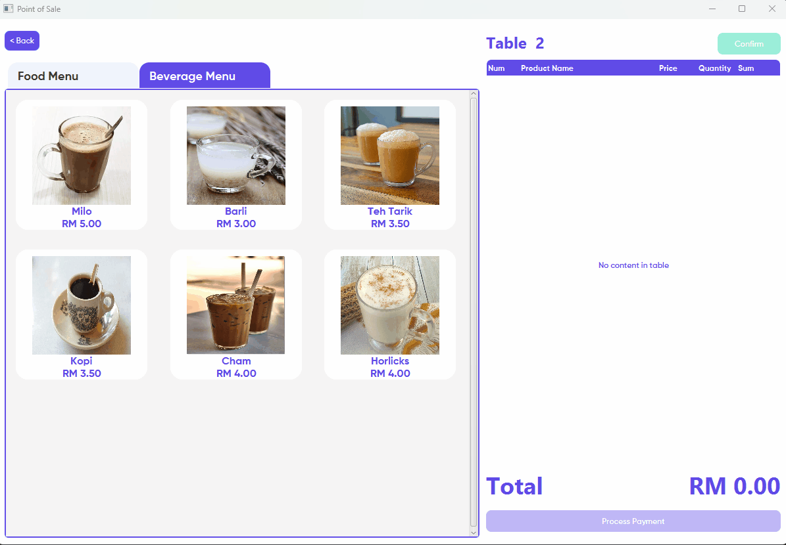
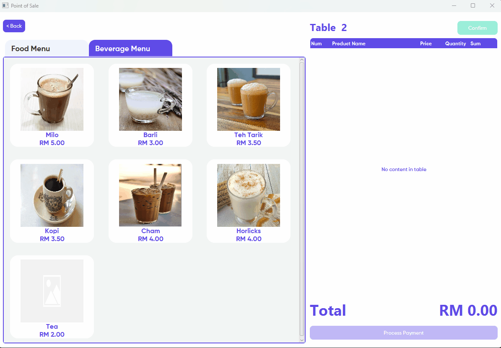
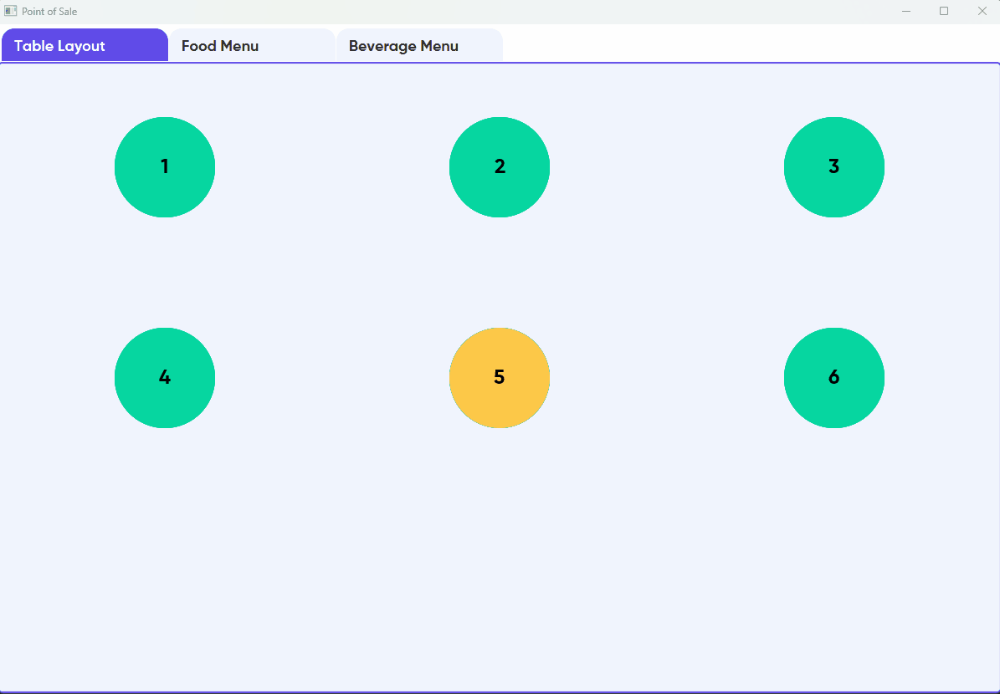

# Introduction
Practicing OOP concept by implementing a point of sale system using Scala and ScalaFx.

## Table Layout
> Table layout in a restaurant and available table occupied when order is confirmed.

## Menu Editing
> Editing the availability of a food and its price.

## Add New Item
> Adding new item to the menu

## Item Accumulation
> Same item with different order preferences by customer does not stack to promote details clarity.

## Payment
> Payment system where user can either select predefined amount or enter a custom amount.

